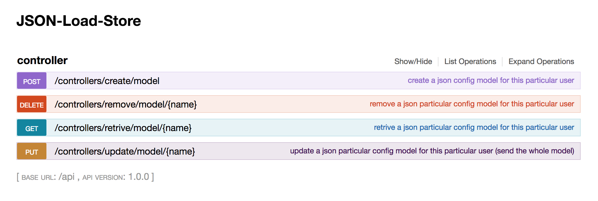
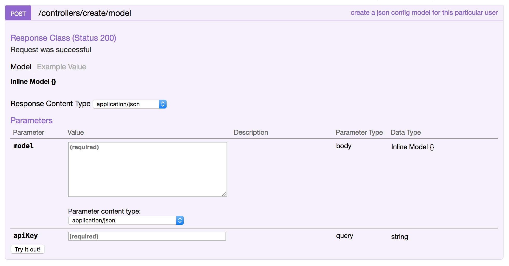
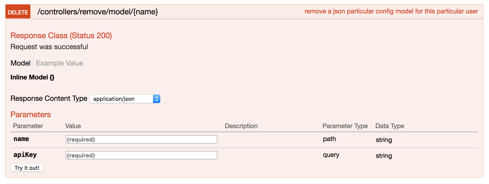
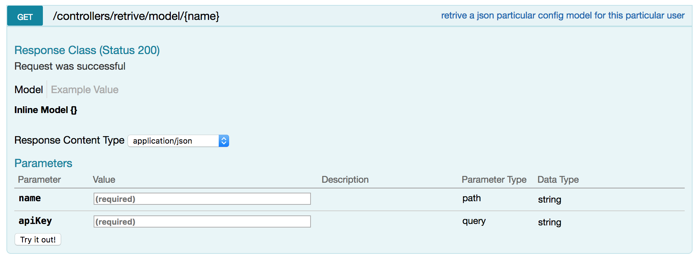
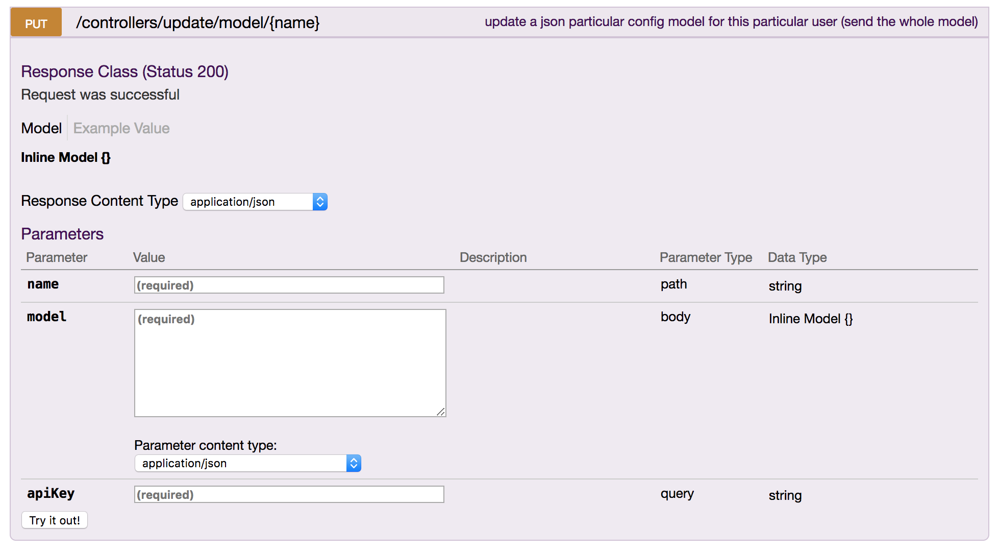

# JSON-Load-Store
With this module, you can simply store your config files in one server and share it between differenct channels and services. This module is based on Redis database, Therefore the performance and the speed of CRUD oprations are extremely high. As there was no SaaS like this, I built one for my own usages sake.

---
## Getting Started

These instructions will get you a copy of the project up and running on your local machine for development and testing purposes. 

### Dependencies
lists the packages that the project depends on and allows to specify the versions of a package that the project mat use using semantic versioning rules. makes your build reproducible, and therefore much easier to share with other developers.
```json
    "compression": 			"^1.0.3",
    "cors": 				"^2.5.2",
    "helmet": 				"^1.3.0",
    "loopback": 			"^3.0.0",
    "loopback-boot": 			"^2.6.5",
    "loopback-component-explorer": 	"^4.0.0",
    "loopback-connector-kv-redis": 	"^1.1.0",
    "loopback-connector-redis": 	"^0.1.0",
    "loopback-datasource-juggler": 	"^3.15.4",
    "serve-favicon": 			"^2.0.1",
    "strong-error-handler": 		"^2.0.0"
```

### Installation
Please install the following dependencies before building JSON-Loader. This is the recommended way to install dependencies on your machine.
```sh
$ npm install
```
### Retriving API Key
After buidling the project, You have to have a valid API Key. This key will distingushes the users from eachother wich they wont be able to access to another users' resources.

For now, There's no API Key Generator, You can simply generate any. But make sure to use a common api key in all your requests!
### Running Web Service
Once you have installed the dependencies, You can run the development instance webservice which is listening on port 3000. You can change the port in config.json file later on. 
```sh
$ node .
  Web server listening at: http://localhost:3000
  Browse your REST API at http://localhost:3000/explorer
```

---
## API References
By browing the `http://localhost:3000/explorer` you can visualy watch the GUI API. Another great way to learn more about the routes and APIs included with module is to read their source. Look under the `common/models` directory for models like basic and controller. From the source and provided diagram you can get an accurate understanding of each route's behavior and API.



### Create Config Model
In order to create a config model you need to specify its name and data in JSON format in payload of POST request alongside the apiKey in queryString.



#### Http responce status codes
* 200: Successful Operation, Model is sucessfully stored in DB for this user.
* 400: Bad Request, One or more required properties are missing.
* 409: Conflict, There's more than one model with specified name for this user.
* 428: Precondition Required, The entered model is not complete.

### Remove Config Model
In order to remove a config model you need to specify its name alongside the apiKey in queryString.



#### Http responce status codes
* 200: Successful Operation, Model is sucessfully stored in DB for this user.
* 400: Bad Request, One or more required properties are missing.
* 404: Model Not Found, There's no model with specified name for this user.
* 409: Conflict, There's more than one model with specified name for this user.

### Retrive Config Model
In order to retrive a config model you need to specify its name alongside the apiKey in queryString.



#### Http responce status codes
* 200: Successful Operation, Model is sucessfully stored in DB for this user.
* 400: Bad Request, One or more required properties are missing.
* 404: Model Not Found, There's no model with specified name for this user.
* 409: Conflict, There's more than one model with specified name for this user.

### Update Config Model
In order to update a config model you need to specify the modified information in JSON format in payload of POST request alongside the apiKey and name of the model to change in queryString. Remember update is replacing elements by elements!



#### Http responce status codes
* 200: Successful Operation, Model is sucessfully stored in DB for this user.
* 400: Bad Request, One or more required properties are missing.
* 409: Conflict, There's more than one model with specified name for this user.
* 428: Precondition Required, The entered model is not complete.

---
## Contributing
I actively welcome contributions from the community and would like to have your helping hand on Mobile-Auth! For more information on what I'm looking for and how to get started, Feel free to contact me. You are welcome to add any feature.

---
## Licence
The MIT License (MIT)

Copyright (c) 2018 Alirëza WJ Arabi

Permission is hereby granted, free of charge, to any person obtaining a copy of this software and associated documentation files (the "Software"), to deal in the Software without restriction, including without limitation the rights to use, copy, modify, merge, publish, distribute, sublicense, and/or sell copies of the Software, and to permit persons to whom the Software is furnished to do so, subject to the following conditions:

The above copyright notice and this permission notice shall be included in all copies or substantial portions of the Software.

THE SOFTWARE IS PROVIDED "AS IS", WITHOUT WARRANTY OF ANY KIND, EXPRESS OR IMPLIED, INCLUDING BUT NOT LIMITED TO THE WARRANTIES OF MERCHANTABILITY, FITNESS FOR A PARTICULAR PURPOSE AND NONINFRINGEMENT. IN NO EVENT SHALL THE AUTHORS OR COPYRIGHT HOLDERS BE LIABLE FOR ANY CLAIM, DAMAGES OR OTHER LIABILITY, WHETHER IN AN ACTION OF CONTRACT, TORT OR OTHERWISE, ARISING FROM, OUT OF OR IN CONNECTION WITH THE SOFTWARE OR THE USE OR OTHER DEALINGS IN THE SOFTWARE.